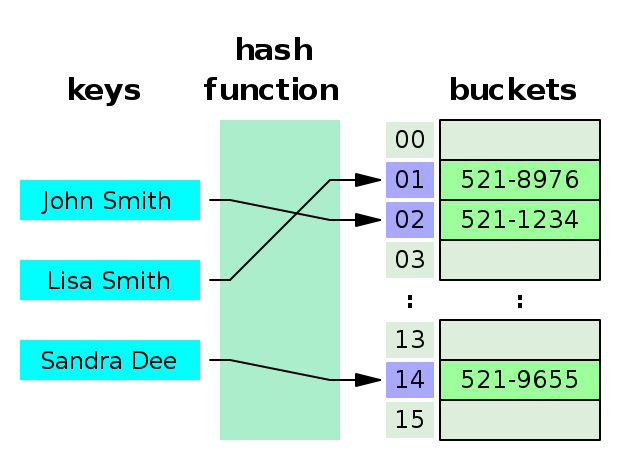

📖 **Contents**
* [Array](#array)
* [LinkedList](#linkedlist)
* [HashTable](#hashtable)
* [Stack](#stack)
* [Queue](#queue)
* [Graph](#graph)
* [Tree](#tree)
* [그래프(Graph)와 트리(Tree)의 차이점](#그래프와-트리의-차이점)
* [Binary Heap](#binary-heap)
* [Red-Black Tree](#red-black-tree)
* [B+ Tree](#B+-Tree)

---

## Array
dsd
sd
sd
s
d
s
ds
d
s
ds
d
s

## LinkedList

## HashTable
### HashTable 개념
* key와 value를 1:1로 연관지어 저장하는 자료구조
* key를 이용하여 value 도출

### HashTable 기능
* key, value가 주어졌을 때, 두 값을 저장
* key가 주어졌을 때, 해당 key에 연관된 value 조회
* 기존 key에 새로운 value가 주어지면, 새로운 value로 대체
* key가 주어졌을 때, 해당 key에 연관된 value 제거
### HashTable 구조

### Key, Hash Function, Value
**key** - 고유한 값
**Hash Function** - Key를 Hash로 바꿔주는 역할
**Hash** - Hash Function의 결과/ 저장소에서 Value와 매칭되어 저장
**Value** - 저장소에 최종적으로 저장되는 값/ 키와 매칭되어 저장, 삭제, 접근 가능

>> https://github.com/WeareSoft/tech-interview/blob/master/contents/datastructure.md#hashtable

## Stack
: 한 쪽 끝에서만 자료를 넣고 뺄 수 있는 LIFO(Last In First Out) 형식의 자료 구조

### Stack의 연산
* 가장 최근에 스택에 추가한 항목이 가장 먼저 제거될 항목이다.
  * pop() : 스택에서 가장 위에 있는 항목을 제거
  * push(item) : item 하나를 스택 가장 윗 부분에 추가
  * peek() : 스택의 가장 위에 있는 항목을 반환
  * isEmpty() : 스택이 비어 있을 때 true를 반환
### stack의 사용 사례
* 재귀 알고리즘을 사용하는 경우 유용 https://www.youtube.com/watch?v=aPYE0anPZqI
* 웹 브라우저 방문기록 (뒤로가기)
* 실행 취소 (undo)
* 역순 문자열 만들기
* 후위 표기법 계산

## Queue
: 컴퓨터의 기본적인 자료 구조의 한가지로, 먼저 집어 넣은 데이터가 먼저 나오는 FIFO(First In First Out) 구조로 저장하는 형식

### Queue의 연산
  * add(item) : item을 리스트의 끝부분에 추가
  * remove() : 리스트의 첫번째 항목을 제거
  * peek() : 큐에서 가장 위에 있는 항목을 반환
  * imEmpty() : 큐가 비어 있을 때에 true를 반환

### Queue의 사용 사례
: 데이터가 입력된 시간 순서대로 처리해야 할 필요가 있는 경우에 이용한다.
* 캐시(Cache) 구현
* 우선순위가 같은 작업 예약 (인쇄 대기열)
* 선입선출이 필요한 대기열 (티켓 카운터)
* 콜센터 고객 대기시간
* 프린터의 출력 처리
* 윈도우 시스템의 메시지 처리기
* 프로세스 관리

## Graph
https://github.com/WeareSoft/tech-interview/blob/master/contents/datastructure.md#graph